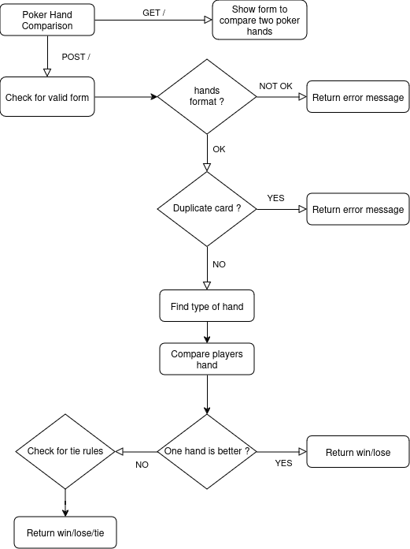
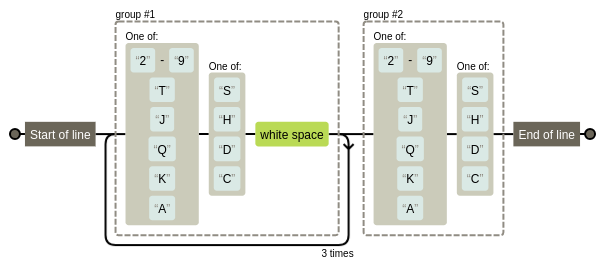

Poker Test
==========

Comme personne ne se souvient du classement des cartes, vous devrez écrire un programme qui compare les mains de poker et détermine un gagnant.

# Fonctionnement de l'application

# Schéma



## Format des mains

Une main d'un joueur se compose de la manière suivante :
* Un espace est utilisé comme séparateur de cartes ;
* Chaque carte est composée de deux caractères ;
* Le premier caractère est la valeur de la carte, les caractères valides sont : `2`, `3`, `4`, `5`, `6`, `7`, `8`, `9`, `T`(en), `J`(ack), `Q`(ueen), `K`(ing), `A`(ce) ;
* Le deuxième caractère représente la couleur, les caractères valides sont : `S`(pades), `H`(earts), `D`(diamonds), `C`(lubs).

Pour vérifier que la main fourni par l'utilisateur est conforme, nous utilisons la regex suivante : `^([2-9TJQKA][SHDC]\s){4}([2-9TJQKA][SHDC])$`



## Types de main

Les types de main possibles sont les suivant :
* Quinte flush royale : La meilleure main possible, composée de cinq cartes consécutives, de la même couleur, allant de l'As au 10 (As, Roi, Dame, Valet, 10). Ex : A♠ K♠ Q♠ J♠ 10♠ ;
* Quinte flush : Cinq cartes consécutives de la même couleur, mais qui ne vont pas jusqu'à l'As. Ex : 9♣ 8♣ 7♣ 6♣ 5♣ ;
* Carré : Quatre cartes de même valeur. Ex : 9♠ 9♦ 9♣ 9♥ ;
* Full : Une combinaison de trois cartes de même valeur et une paire de cartes d'une autre valeur. Ex : 7♠ 7♦ 7♣ 2♠ 2♦ ;
* Brelan : Trois cartes de même valeur. Ex : 4♠ 4♦ 4♣ ;
* Deux paires : Deux paires de cartes de même valeur. Ex : 5♠ 5♦ 8♠ 8♣ ;
* Paire : Deux cartes de même valeur. Ex : 10♠ 10♦ ;
* Carte haute : La main la plus faible, où la plus haute carte détermine la force de la main (par exemple, As, Roi, etc.). Ex : K♠ 9♦ 7♣ 4♠ 2♠.

## Comparaison des Mains de Poker

Lorsqu'on compare les mains de deux joueurs, la première étape consiste à déterminer le type de main de chaque joueur (ex : Full House, Flush, etc.).

### Stratégie de Comparaison

Les règles de comparaison suivent un ordre logique :

* On compare d'abord les types de main en fonction de leur force.
* Si les types sont identiques, on applique le tie-breaker basé sur les cartes identiques (paires, brelans, etc.), et si nécessaire, sur les cartes restantes (kickers).
* Le match nul est géré dans les cas où les mains sont identiques ou si les règles du tie-breaker ne permettent pas de départager les joueurs.

### Egalité

Si les deux mains ont le même type (par exemple, les deux joueurs ont une paire), il faut alors appliquer un tie-breaker pour départager les joueurs. 

La logique de cette gestion des égalités varie en fonction du type de main et est définie dans la méthode `tie_breaker()` de la classe `HandComparator`. 

La fonction tie_breaker() détermine quel type de comparaison est nécessaire en fonction du type de main des joueurs.
Si les mains sont de types simples comme `high_card`, `flush`, ou `straight`, `compare_highest()` est utilisé pour comparer les cartes les plus élevées.
Si les mains contiennent des répétitions de cartes (comme des paires ou des brelans), `format_before_compare()` est utilisé pour organiser les cartes par fréquence avant de les passer à `compare_highest()`.

#### Fonction compare_highest()

La fonction `compare_highest()` est utilisée pour départager les joueurs, où la comparaison se fait en fonction des cartes les plus fortes.

Fonctionnement :
* Elle prend deux tableaux `rank_indices_1` et `rank_indices_2`, représentant les indices des cartes des joueurs dans un ordre croissant.
* Elle compare la carte la plus haute des deux mains (la dernière carte du tableau trié).
* Si les cartes sont égales, elle retire cette carte des deux mains et compare la carte suivante. Ce processus continue jusqu'à ce qu'une carte plus haute soit trouvée ou que les deux mains soient identiques (ce qui donnerait un match nul).

#### Fonction format_before_compare

Cette fonction est utilisée dans le cas où les mains contiennent des répétitions de cartes.

Elle organise les cartes par fréquence (combien de fois chaque valeur de carte apparaît). 

Par exemple : Une main avec une paire (par exemple, 2H 2D 5C 6S 7H) devrait avoir les cartes organisées pour que la paire apparaisse en premier.

Fonctionnement :
* Comptage des occurrences : La fonction compte combien de fois chaque carte apparaît dans la main (`avec array_count_values()`).
* Tri par fréquence : Ensuite, elle trie les cartes par fréquence d’apparition. Par exemple, si une main a un brelan (trois cartes identiques), le brelan est mis en avant dans la comparaison.
* Retour de la liste formatée : La fonction retourne une liste d'indices triés qui peut être utilisée par `compare_highest()` pour effectuer la comparaison.

Exemple :
```
Si la main est 2H 2D 5C 6S 7H, la fonction compte les occurrences de chaque carte : {2: 2, 5: 1, 6: 1, 7: 1}.
Puis, elle trie ces occurrences pour donner l'ordre correct des cartes : [2, 5, 6, 7].
Cette liste est ensuite passée à compare_highest() pour déterminer la main gagnante.
```

# Installation

```
cd docker

docker compose build
docker compose up -d

docker compose ps

# install vendor
docker compose exec php composer install
docker compose exec php php bin/console cache:clear
```

L'url du site : http://localhost:8080/

# Tests

Lancement des tests unitaires : `$ php bin/phpunit --testdox`